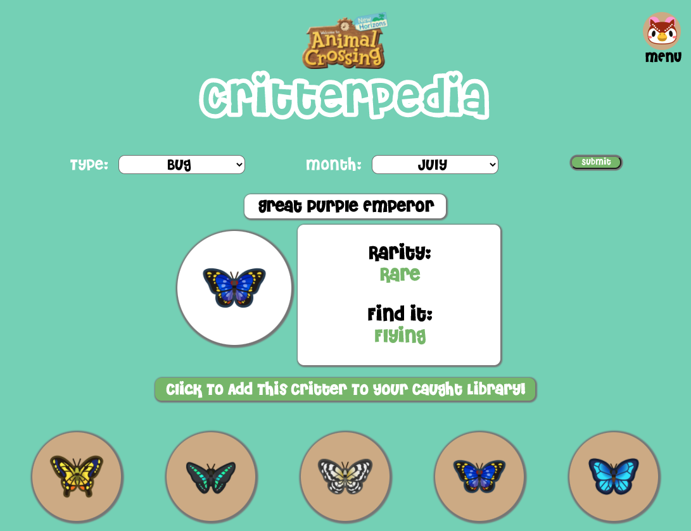

# :bug: Critterpedia :tropical_fish:  
React App using third-party API data.  
Check out the [live site!](https://laurencolvin.github.io/project-2-react/)


## Project Description

For this project I created an Animal Crossing Critterpedia resource. The main page helps you search for what critters are available at a specific month. You can click on any critters you catch and they will be added to your caught library. You can also view all bugs, fish or diving critters on their own pages. Scroll through to see all of the things you have yet to catch and plan your strategy based on month.

## API

[https://acnhapi.com/v1/bugs/32]()


```
{data: {"id": 32,
"file-name": "red_dragonfly",
"name": {
"name-USen": "red dragonfly",
"name-EUen": "red dragonfly",
"name-EUde": "Feuerlibelle",
"name-EUes": "libélula roja",
"name-USes": "libélula roja",
"name-EUfr": "sympetrum",
"name-USfr": "libellule rouge",
"name-EUit": "libellula rossa",
"name-EUnl": "rode libel",
"name-CNzh": "红蜻蜓",
"name-TWzh": "紅蜻蜓",
"name-JPja": "アキアカネ",
"name-KRko": "고추잠자리",
"name-EUru": "красная стрекоза"
},
"availability": {
"month-northern": "9-10",
"month-southern": "3-4",
"time": "8am - 7pm",
"isAllDay": false,
"isAllYear": false,
"location": "Flying",
"rarity": "Common",
"month-array-northern": [
9,
10
],
"month-array-southern": [
3,
4
],
"time-array": [
8,
9,
10,
11,
12,
13,
14,
15,
16,
17,
18
]
},
"price": 180,
"price-flick": 270,
"catch-phrase": "I caught a red dragonfly! Didn't even have to roll for initiative!",
"museum-phrase": "I won't deny that the wretched red dragonfly is an elegant aeronaut. It manipulates its four wings quite uniquely so it can hover and maneuver through the air with ease. But the veins on its wings! What ghastly things! One can't help but gasp at the sight of them... Appalling aerodynamics, indeed!",
"image_uri": "https://acnhapi.com/v1/images/bugs/32",
"icon_uri": "https://acnhapi.com/v1/icons/bugs/32"} }
```


## Wireframes

- [Wireframe Mobile](https://wireframepro.mockflow.com/view/Mwp7JBecunb#/page/b9ef194be98d41b0a223b32011dd39a0)
- [Wireframe Desktop](https://wireframepro.mockflow.com/view/Mwp7JBecunb#/page/D99736ccabfbb471d6976e50fad8e0f8f)
- [App Architecture](https://wireframepro.mockflow.com/view/Mwp7JBecunb#/page/D45082a437d1932350ecfeda6e939c439)
 

#### MVP
- Find and use external api 
- Render all critter icons on pages separated by type (bugs, fish, diving) 
- Search dropdowns that filter results to type and month
- Clickable critter icons that add to library when caught
- Single critter info that pops up on the side of your search bar
- Caught library page that displays all your critters

#### PostMVP

- Add about me and landing page
- Add random critter of the day info
- Add a carousel of all critter info on pages separated by type (bugs, fish, diving) 
- Add a filter based on where the critters can be found
- Add further drop down searches based on price or how rare they are

## Components 

| Component | Description | 
| --- | :---: | 
| App | This will make the initial data pull and include React Router|
| Landing Page | Describe the purpose of the site and show a random critter of the day | 
| Main Search Page | Include search dropdowns that filter results | 
| Single Critter | Card with critter info that pops out on the side | 
| Caught Library | Icons of all caught critters organized by category | 
| Fish Library | Icons of all fish critters- carousel with extra data on each individual critter | 
| Bugs Library | Icons of all bug critters- carousel with extra data on each individual critter  | 
| Diving Library | Icons of all diving critters- carousel with extra data on each individual critter  | 
| Footer | Include my info and the API I used |

## MVP

| Component | Priority | Estimated Time | Time Invetsted | Actual Time |
| --- | :---: |  :---: | :---: | :---: |
| Create Components with Links/Routes | H | 3hrs| 2hrs | 2hrs |
| Working with API | H | 3hrs| 6hrs | 6hrs |
| Display and Style Icons | M | 2hrs| 4hrs | 4hrs |
| Create Search dropdowns| H | 3hrs| 2hrs | 2hrs |
| Filter data based on dropdowns | H | 5hrs| 3hrs | 3hrs |
| Add clicked icons to Caught Library | M | 2hrs| 1hrs | 1hrs |
| Create Single Critter info cards | M | 5hrs| 2hrs | 2hrs |
| Responsive Design | M | 3hrs| 3hrs | 3hrs |
| Total | H | 26hrs| 23hrs | 23hrs |

## Post-MVP

| Component | Priority | Estimated Time | Time Invetsted | Actual Time |
| --- | :---: |  :---: | :---: | :---: |
| Create Carousel of critter data | H | 5hrs| 0hrs | 0hrs |
| Add random critter of the day | H | 2hrs| 2hrs | 2hrs |
| Add about me and footer | H | 2hrs| 2hrs | 2hrs |
| Add more dropdown search data | H | 3hrs| 0hrs | 0hrs |
| Total | H | 12hrs| 4hrs | 4hrs |

## Additional Libraries
 Use this section to list all supporting libraries and thier role in the project such as Axios, ReactStrap, D3, etc. 

## Code Snippet

```
//Getting my random critter of the day

const getCritter = () => {
    let critterArray = Object.keys(critterData);
    let randomCritter = Math.floor(Math.random() * critterArray.length);
    currentCritter = critterData[critterArray[randomCritter]];
    if (currentCritter !== undefined) {
      return (
        <div>
          <h2>{currentCritter.name["name-USen"]}</h2>
          
          <h2>Catch Prase:</h2><p className="catch-phrase">{currentCritter["catch-phrase"]}</p>
        </div>
    );}
};

```